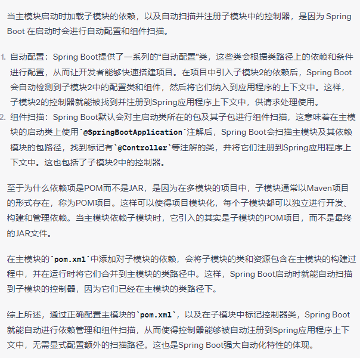
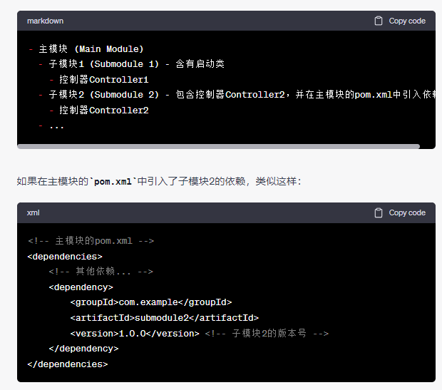

当主模块启动时加载子模块的依赖，以及自动扫描并注册子模块中的控制器，是因为 Spring Boot 在启动时会进行自动配置和组件扫描。

自动配置：Spring Boot提供了一系列的“自动配置”类，这些类会根据类路径上的依赖和条件进行配置，从而让开发者能够快速搭建项目。在项目中引入子模块2的依赖后，Spring Boot会自动检测到子模块2中的配置类和组件，然后将它们纳入到应用程序的上下文中。这样，子模块2的控制器就能被找到并注册到Spring应用程序上下文中，供请求处理使用。

组件扫描：Spring Boot默认会对主启动类所在的包及其子包进行组件扫描，这意味着在主模块的启动类上使用@SpringBootApplication注解后，Spring Boot会扫描主模块及其依赖模块的包路径，找到标记有@Controller等注解的类，并将它们注册到Spring应用程序上下文中。这也包括了子模块2中的控制器。

至于为什么依赖项是POM而不是JAR，是因为在多模块的项目中，子模块通常以Maven项目的形式存在，称为POM项目。这样可以使得项目模块化，每个子模块都可以独立进行开发、构建和管理依赖。当主模块依赖子模块时，它引入的其实是子模块的POM项目，而不是最终的JAR文件。

在主模块的pom.xml中添加对子模块的依赖，会将子模块的类和资源包含在主模块的构建过程中，并在运行时将它们合并到主模块的类路径中。这样，Spring Boot启动时就能自动扫描到子模块的控制器，因为它们已经在主模块的类路径下。

综上所述，通过正确配置主模块的pom.xml，以及在子模块中标记控制器类，Spring Boot就能自动进行依赖管理和组件扫描，从而使得控制器能够被自动注册到Spring应用程序上下文中，无需显式配置额外的扫描路径。这也是Spring Boot强大自动化特性的体现。

在 Spring Boot 中，启动类默认只会加载当前模块（项目）的依赖，而不会自动加载其他模块的依赖。这是因为在 Java 虚拟机的类加载机制中，每个模块的类加载器都是独立的，相互之间无法直接访问对方的类。因此，Spring Boot 的启动类在默认情况下只会扫描并加载当前模块的类路径下的组件，例如控制器 `@Controller`、服务 `@Service` 等。

如果你希望主模块的启动类能够扫描到其他模块中的 `@Controller` 注解，通常有以下几种方法：

1. **使用依赖：** 在主模块的 `pom.xml` 中添加其他模块的依赖，这样主模块就能够访问到其他模块的类。这是最常见的方式，也是最推荐的方式。

2. **多模块打包：** 如果你使用 Maven 或 Gradle 进行多模块项目的构建，并且将子模块打包成 JAR 文件，你可以将打包后的 JAR 文件作为主模块的依赖，然后在主模块的启动类上进行组件扫描。这样主模块就能够扫描到子模块中的组件。

3. **组件扫描路径：** 如果你确定其他模块的类路径在主模块的启动类可以访问到，你可以通过在主模块的启动类上添加 `@ComponentScan` 注解，手动指定其他模块的包路径。例如：`@ComponentScan({"com.example.submodule1", "com.example.submodule2"})`。这样主模块的启动类会扫描指定的包路径，从而找到其他模块中的组件。

请注意，无论采用哪种方式，被扫描的模块中的控制器 `@Controller` 必须标注为 Spring Bean，例如在类上添加 `@Component` 或其衍生注解，以确保这些控制器会被扫描并注册到 Spring 应用程序上下文中。

